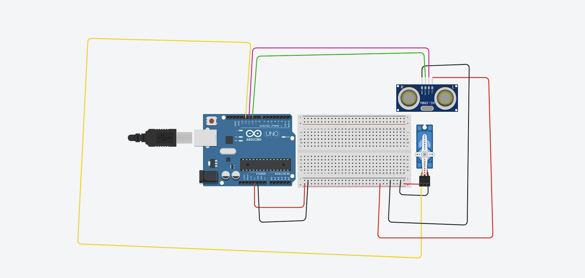

# Radar-Detection-System

A smart radar system using ultrasonic sensors and servo motors.

### 📖 Table of Contents
- [📌 About the Project](#-about-the-project)  
- [🛠️ Components Used](#-components-used)  
- [🔧 Circuit Diagram](#-circuit-diagram)  
- [⚙️ Installation & Setup](#-installation--setup)  
- [🚀 How It Works](#-how-it-works)  
- [📷 Demo & Images](#-demo--images)  
- [📝 License](#-license) 

🔹 Technologies Used:

Arduino (C++)
Processing (for visualization)
Ultrasonic sensor (HC-SR04)
Servo motor MG90S (for movement)

### 🛠️ Components Used
✅ 1x Arduino UNO
✅ 1x HC-SR04 Ultrasonic Sensor
✅ 1x SG90 Servo Motor
✅ 1x OLED/LED Display (Optional)
✅ Breadboard & Jumper Wires

### 🔧 Circuit Diagram

### 📜 View Full Schematic
[View Full Schematic](schematic_circuit.png)

### ⚙️ Installation & Setup
1️⃣ Install Arduino IDE from here
2️⃣ Connect the components as shown in the circuit diagram
3️⃣ Upload the Radar.ino code to Arduino
4️⃣ Run the Processing script for visualization (if applicable)

### 🚀 How It Works
🔹 The ultrasonic sensor sends pulses and measures distances.
🔹 The servo motor rotates the sensor to scan the area.
🔹 Data is sent to a display or Processing for visualization.
🔹 If an object is detected, a signal can be triggered.

### 📷 Demo & Images

[Watch Full Demo](https://youtube.com/shorts/39jKKc9EM-A?si=kU4zIgdn9sroy9mW)
[Images](imagine_el.JPEG)

### 📝 License
This project is open-source and licensed under the MIT License.

### 📌 Contributors:
👤 FODOKA DAVID-ANDREI

🔹 Feel free to fork, modify, and improve this project! 🚀

